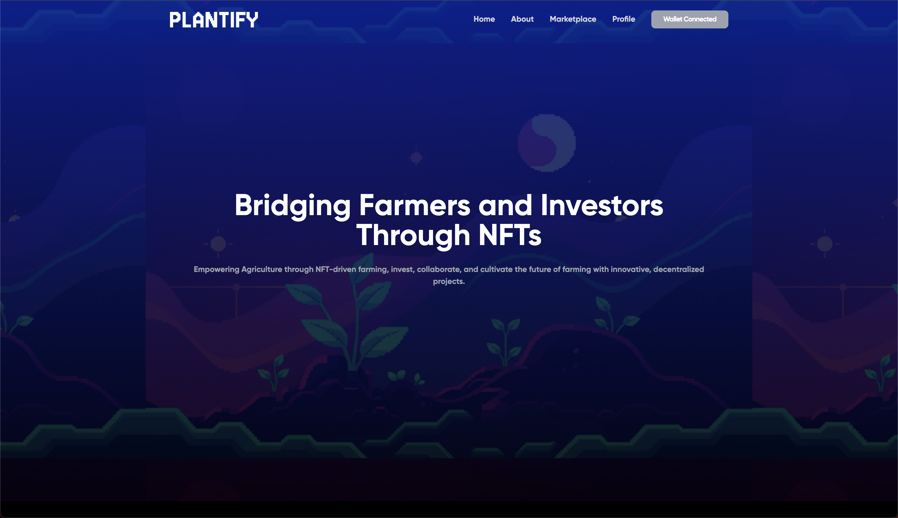
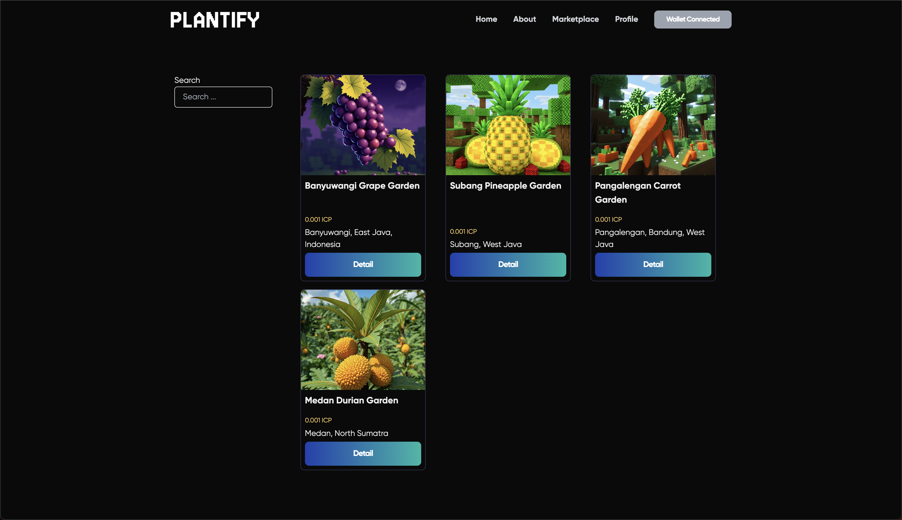
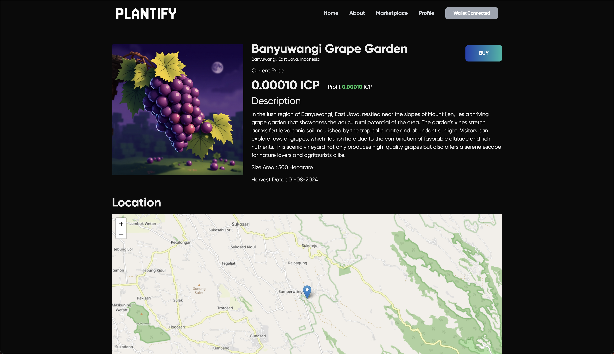
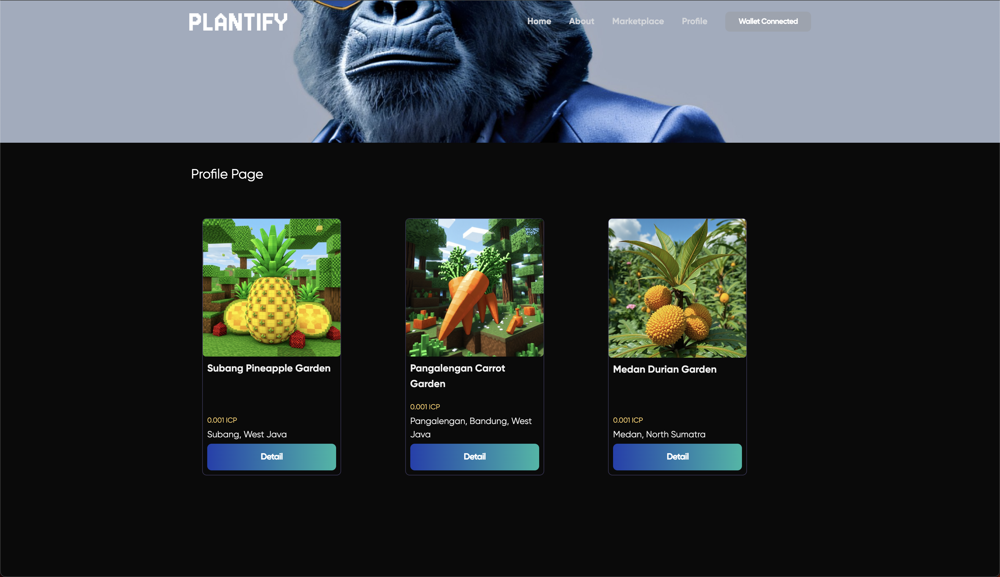

# Plantify

**Try the application [here](https://4gmjl-iyaaa-aaaam-qbehq-cai.icp0.io/).**

## Project Overview
Plantify is a platform that enables individuals to invest in real-world agricultural projects through NFTs, with the involvement of Internet Computer Protocol (ICP) for enhanced scalability, security, and decentralization. Instead of owning land, NFT holders finance the operational costs of these projects and share in the profits from the harvest. The platform connects farmers with investors, ensuring transparency and accountability via blockchain technology, powered by ICP.

### Key Features
- **NFT-Based Agricultural Investments:** Users purchase NFTs representing financial stakes in specific agricultural projects. Each NFT finances a portion of the operational costs, allowing investors to contribute directly to the farm’s productivity. ICP ensures decentralized management of these transactions, enhancing security and transparency.
- **Profit-Sharing Model:** The profits from the agricultural yield are shared among NFT holders according to their investment size. ICP-powered smart contracts handle the automatic distribution of profits, ensuring fairness and transparency without the need for intermediaries.
- **Marketplace and Resale:** NFTs can be traded on a decentralized marketplace, supported by ICP’s high-speed and scalable blockchain infrastructure. This gives investors the flexibility to sell their stakes or purchase more. The value of these NFTs can increase if the project is profitable or shows strong yield projections.

## Application Screenshots
Below are some screenshots of the application showcasing its features:

### Home Screen

### About Screen

### Marketplace Screen

### Detail Marketplace Screen

### Profile Screen

## Getting Started
To get started with this project, clone the repository and follow the installation instructions provided in the documentation.

## Contributing
We welcome contributions from the community. Please fork the repository and submit pull requests with any enhancements or bug fixes.

## License
This project is licensed under the MIT License. See the [LICENSE](LICENSE) file for more details.

## Contact
For any questions or inquiries, please contact us.